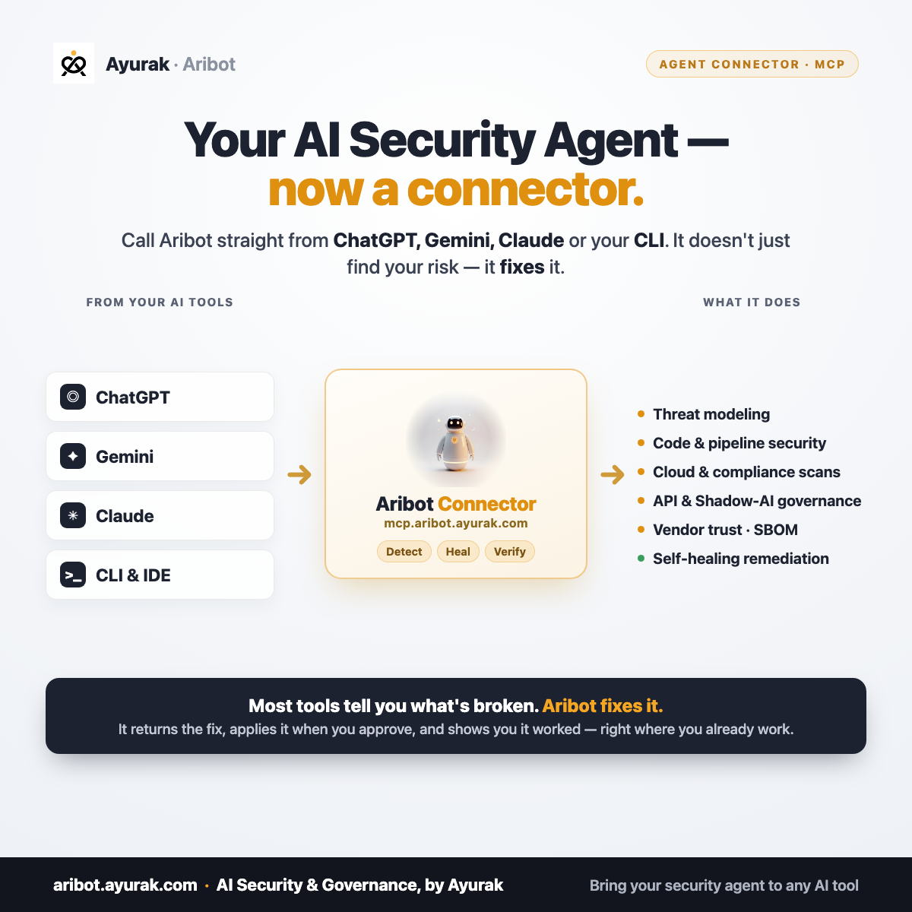

<p align="center">
  
</p>

# Aribot — MCP server for security work

[](https://aristiun.github.io/aribot-mcp/)

**Live page:** https://aristiun.github.io/aribot-mcp/ · **Product:** https://aribot.ayurak.com · **Registry:** `io.github.aristiun/aribot`

Aribot is a security tool from [Ayurak / Aristiun](https://aribot.ayurak.com), available as a remote **Model Context Protocol (MCP)** server. Connect it to any MCP client — ChatGPT, Gemini, Claude, or your own — and run real security work from the assistant you already use, without switching tools.

> This repository is a public manifest for the hosted server. It contains no product code — only the connection details. The server requires OAuth, so listing its address exposes nothing without an authorized login.

## Unified threat modeling — one model, not five tools

Aribot builds **one threat model per system** and layers every discipline onto it — **security** (STRIDE + LINDDUN), **cloud** posture (AWS · Azure · GCP), **compliance** (NIST · ISO 27001 · SOC 2), and the **economics** of each risk (value at risk, cost to fix, dollars saved once healed) — all kept **traceable end to end**:

`Threat → Requirement → Control → Framework → Code → Fix`

Ask for any link in that chain, in either direction, with evidence behind every finding and every fix.

## What you can do with it

### Threat modeling
- Turn a diagram or a written description of a system into a full threat model
- STRIDE and LINDDUN coverage, generated per component and per data flow
- Threats mapped to the security controls, requirements, and compliance frameworks that address them
- A traceability view from each threat → finding → control → requirement → remediation
- Re-model as the design changes; link related diagrams and reuse component threat libraries

### Scanning
- **Code security** — static analysis of a connected repository
- **Pipeline security** — CI/CD configuration and supply-chain checks
- **Cloud & compliance** — posture checks across AWS, Azure, and GCP accounts
- **SBOM** — generate a software bill of materials
- **Shadow AI & API discovery** — find where AI/LLM use and API endpoints have spread across your estate

### Compliance
- Coverage and control status against NIST, ISO 27001, SOC 2, and other frameworks
- See which controls a threat model or scan already satisfies, and where the gaps are

### Vendors
- Assess a third party's posture and fold it into your own risk view

### Remediation
- Get a fix for a finding — as code, cloud configuration, or infrastructure-as-code
- Keep it advisory, or apply it (e.g. open a pull request or push a cloud change) under approval

## Connect

Point any MCP client at the server and complete the OAuth prompt:

```
https://mcp.aribot.ayurak.com/mcp
```

| | |
|---|---|
| **Transport** | Streamable HTTP |
| **Auth** | OAuth 2.1 (Authorization Code + PKCE; Dynamic Client Registration) |
| **Homepage** | https://aribot.ayurak.com |

OAuth is discovered automatically at `https://mcp.aribot.ayurak.com/.well-known/oauth-authorization-server`.

Example (Claude Code):

```
claude mcp add --transport http aribot https://mcp.aribot.ayurak.com/mcp
```

## Access controls

Each call is checked against your company's licence, the OAuth scopes you granted (`read:findings`, `read:threatmodel`, `read:insights`, `run:scan`, `run:codereview`, `write:threatmodel`, `run:remediation`), your team's roles, and your tenant boundary. Usage is metered, and every action is logged. So you can run security work from an assistant without losing track of who can do what, or which company's data is which.

## Tools

`generate_threat_model` · `verify_threats_in_code` · `get_traceability` · `get_framework_coverage` · `compliance_status` · `discover_shadow_ai` · `get_api_security` · `get_cloud_compliance` · `get_remediation` · `get_billing`

See the full tool list and pricing at **https://ayurak.com/pricing**.

---

© Ayurak / Aristiun. "Aribot" and "Ayurak" are trademarks of their owner. This manifest is provided for MCP discovery under the MIT License (see `LICENSE`).
